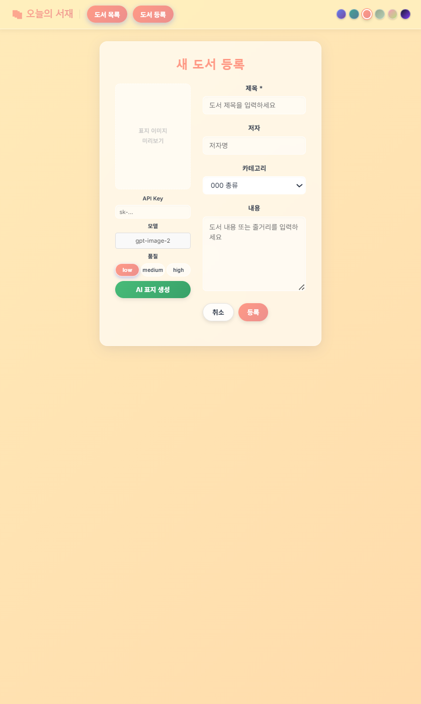
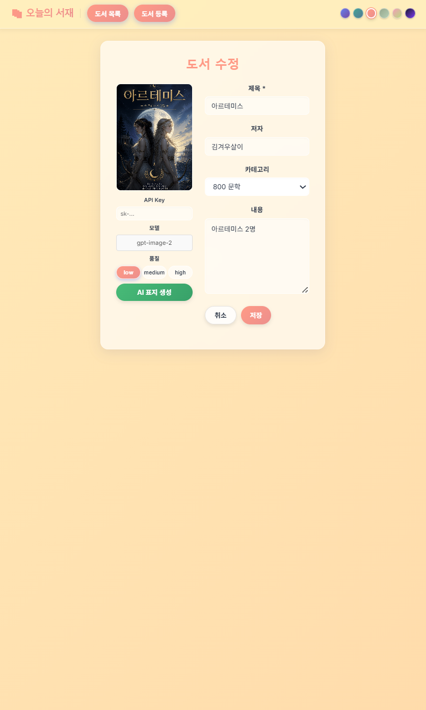

# 📚 오늘의 서재 (Full-Stack Book Management System)

**AI 표지 생성을 지원하고, 객관적인 베이지안 평점 기반으로 도서를 추천해 주는 풀스택 웹 애플리케이션입니다.**

- **개발 인원:** 팀 프로젝트 (총 8인)
- **개발 기간:** 2026.06.08 ~ 2026.06.12

---

## 🛠 Tech Stack

**Frontend**<br>


**Backend**<br>


**Database & Infra**<br>


**Tools & External API**<br>


---

## ✨ 주요 기능

### 1. 도서 관리 (CRUD) 및 카테고리 필터링

- 도서 등록, 수정, 삭제 및 상세 조회 기능
- KDC(한국십진분류법) 기반 카테고리(000~800) 지정 및 목록 필터링 기능

### 2. AI 표지 생성 (OpenAI API)

도서 등록 및 수정 페이지에서 `gpt-image-2` 모델을 활용하여 내용 기반의 표지 이미지를 자동 생성합니다.

- 사용자는 품질(Low/Medium/High)을 선택할 수 있으며, API Key는 서버로 전송되지 않고 브라우저(Local)에서만 안전하게 사용됩니다.

### 3. 리뷰 및 별점 관리

- 도서마다 1~5점의 별점과 리뷰를 등록할 수 있습니다.
- 닉네임과 비밀번호를 기반으로 작성자를 식별하며, 서버 단에서 비밀번호 검증 후 리뷰를 삭제하는 보안 로직이 적용되어 있습니다.

### 4. 베이지안 평점 기반 도서 추천

단순 평균 별점 산출 시 발생할 수 있는 통계적 왜곡(예: 리뷰 1개인 5점 도서가 우선 노출되는 현상)을 방지하기 위해 **베이지안 평점**을 도입했습니다.

- **메인 페이지:** 베이지안 점수 1위 도서 및 화제작 Best 3 노출
- **상세 페이지:** 동일 카테고리 내 추천 도서 자동 매칭

### 5. 사용자 맞춤 테마

- 우측 상단 팔레트에서 5가지 색상 테마로 UI를 변경할 수 있으며, 선택 값은 `localStorage`에 저장되어 유지됩니다.

---

## 🖥 주요 화면

<table width="100%">
  <tr>
    <td></td>
    <td></td>
    <td></td>
    <td></td>
    <td></td>
    <td></td>
  </tr>
  <tr>
    <td align="center"><b>메인 페이지</b></td>
    <td align="center"><b>도서 목록</b></td>
    <td align="center"><b>도서 목록 (최신순)</b></td>
    <td align="center"><b>도서 상세</b></td>
    <td align="center"><b>도서 등록</b></td>
    <td align="center"><b>도서 수정</b></td>
  </tr>
</table>

---

## ⚙️ 시스템 구조 (Architecture)

### 백엔드 (Spring Boot)

Package by Feature 구조 형식을 사용하여 도메인 단위로 패키지를 분리 및 관리합니다.

```text
📦 src/main/java/com/aivle/bookserver
 ┣ 📂 book        # 도서 관련 비즈니스 로직 (Controller, Service, Repository, DTO)
 ┣ 📂 review      # 리뷰 관련 비즈니스 로직
 ┣ 📂 rating      # 베이지안 평점 계산을 위한 공통 로직
 ┣ 📂 config      # CORS 정책 및 DB 초기화 설정
 ┗ 📂 exception   # 전역 예외 처리 및 커스텀 예외
```

### 프론트엔드 (React)

```text
📦 book-app/src
 ┣ 📂 api         # Spring Boot 서버 통신 (config.js, books.js, reviews.js)
 ┣ 📂 components  # 공통 컴포넌트 (Header, 테마 설정 등)
 ┣ 📂 pages       # 페이지 단위 컴포넌트 (Main, BookList, BookDetail, BookForm)
 ┗ 📜 App.jsx     # 라우팅 설정
```

---

## 🗄 데이터베이스 설계 (ERD)

조회 성능을 극대화하기 위해 `BOOK` 테이블에 리뷰 관련 통계(평균 별점, 리뷰 수 등)를 포함하는 **반정규화**를 적용했습니다.


---

## 🔌 API 명세서 (API Reference)

### 📌 서버 기본 환경

- **Base URL:** `http://localhost:8080`
- **Database:** Production: Supabase (PostgreSQL) / Local: H2 In-memory

### 📚 도서 및 리뷰 API (Spring Boot)

| Domain | Method | Endpoint | 기능  | Request | Response |
| --- | --- | --- | --- | --- | --- |
| **Books** | **GET** | `/books` | 도서 목록 조회 | `[Query]` category={분류} | 200 (Book List) |
|     | **GET** | `/books/{id}` | 도서 상세 조회 | -   | 200 (Book) / 404 |
|     | **POST** | `/books` | 도서 등록 | `[Body]` title, author, content... | 201 (Created) |
|     | **PATCH** | `/books/{id}` | 도서 부분 수정 | `[Body]` 수정할 필드 | 200 (Updated) |
|     | **DELETE** | `/books/{id}` | 도서 삭제 | -   | 204 (No Content) |
|     | **GET** | `/books/{id}/related` | 카테고리 추천 Top 3 | -   | 200 (Book List) |
| **Reviews** | **GET** | `/reviews` | 리뷰 목록 조회 | `[Query]` bookId={id} | 200 (Review List) |
|     | **POST** | `/reviews` | 리뷰 등록 | `[Body]` bookId, nickname, password... | 201 (Created) |
|     | **DELETE** | `/reviews/{id}` | 리뷰 삭제 | `[Body]` password 필수 | 204 (No Content) |

### 🤖 외부 API (OpenAI)

| 기능  | Method | Endpoint |
| --- | --- | --- |
| AI 표지 이미지 생성 | **POST** | `https://api.openai.com/v1/images/generations` |

---

## ⭐ 도서 평점 계산 로직 (Bayesian Rating System)

$$rate\_point = \text{round}\left(\frac{C \times m + ratingSum}{C + reviewCount}, 1\right)$$

- $C$: 최소 투표 수 (고정값 5)
- $m$: 평점이 존재하는 전체 도서의 평균 별점 (데이터가 없을 시 초기값 3.5 적용)
- $ratingSum$: 해당 도서가 받은 별점의 총합
- $reviewCount$: 해당 도서의 총 리뷰 수

> **💡 Note:** 리뷰 등록 및 삭제 API 호출 시, 서버 내부 로직에 의해 베이지안 평점이 자동 재계산되어 DB에 동기화됩니다.

---

## 🚀 실행 가이드 (Getting Started)

프로젝트 클론 후 프론트엔드와 백엔드를 각각 실행해야 합니다.

**1. 저장소 클론**

```bash
git clone [https://github.com/Jiae-Ham/AivleSchool_miniproj4.git](https://github.com/Jiae-Ham/AivleSchool_miniproj4.git)
```

**2. 백엔드 실행 (Spring Boot)**

- 프로젝트 최상단 디렉터리에 `.env` 파일을 생성하거나 `application.yaml`을 수정하여 Supabase 연결 정보를 설정합니다. (로컬 테스트 시 H2 DB 사용 가능)
  
  ```bash
  cd AivleSchool_miniproj4/bookserver
  ./gradlew build
  ./gradlew bootRun
  ```
  

**3. 프론트엔드 실행 (React)**

- 새로운 터미널 창을 열고 프론트엔드 디렉터리로 이동하여 패키지를 설치합니다.
  
  ```bash
  cd AivleSchool_miniproj4/book-app
  npm install
  npm run dev
  ```
  

**4. 접속**

- 브라우저에서 `http://localhost:5173` 으로 접속하여 서비스를 이용합니다.
